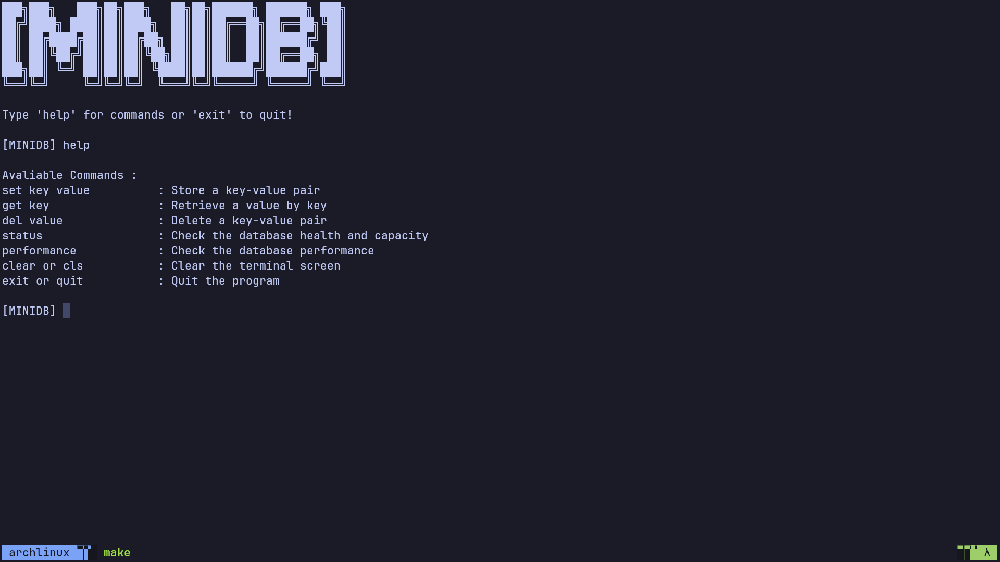

# MiniDB

A blazing-fast, in-memory key-value database built entirely from scratch in C.

MiniDB is an embedded database engine designed to process millions of operations per second. It acts as an LRU (Least Recently Used) cache and relies on custom memory management, bitwise math, and an optimized hashing algorithm to achieve extreme hardware efficiency.

## Project Journey

This project was built from the ground up to deeply understand how production-grade systems like Redis and Memcached work under the hood. It wasn't just about making a data structure; it was about hunting down every single performance bottleneck from CPU cycles to OS-level memory locks and engineering a way around them.

Through consistent iteration, testing, and profiling, the engine evolved from a basic Hashmap that took **19 seconds to process a million keys**, into a multi-sharded architecture that handles them in just a few seconds.

## Problems Faced & How I Solved Them

Building a database from scratch revealed that theoretical code doesn't always translate to fast software. Here are the major architectural roadblocks I hit and how I solved them:

### 1. The "Malloc Tax" (Memory Allocation Bottlenecks)
* **The Problem:** Calling `malloc` and `free` for every single key insertion forced the database to constantly wait on the Operating System, killing performance.
* **The Solution:** I built a **Memory Arena (Node Pool)**. The database pre-allocates one massive block of memory at startup. Nodes are recycled using a "Free List" stack, and strings are kept inline.
**Result:** Zero OS-level memory allocations during normal read/write operations.

### 2. Slow CPU Math & Hashing
* **The Problem:** The standard **FNV-1a** hashing algorithm processed strings one byte at a time, and calculating array indexes using modulo division (`%`) was wasting valuable CPU cycles.
* **The Solution:** I upgraded the hashing engine to **MurmurHash3** (processing data in 32-bit chunks) and replaced the slow division operator with a lightning-fast **Bitwise AND (`&`)** mask, enforcing a strict power-of-two capacity rule.

### 3. Tombstone Pollution (The Wasted Loops Bug)
* **The Problem:** When the cache filled up, the LRU eviction policy worked, but it left "Deleted" markers (tombstones) everywhere. Eventually, the database had to loop through thousands of dead spots just to find a single key.
* **The Solution:** I implemented a **Garbage Collection (Rehashing)** system. Whenever a shard reaches 75% capacity of active and dead data, it briefly pauses, creates a clean table, moves only the active keys, and wipes the garbage to guarantee $O(1)$ lookups.

### 4. Single-Thread Limitations
* **The Problem:** A single massive database means only one process can safely write to it at a time.
* **The Solution:** I architected the database to use **Multi-Sharding**. The core router hashes a key and assigns it to one of multiple independent shards. This keeps CPU cache sizes small and lays the exact groundwork needed for future concurrent lock-striping.

## Performance

Because MiniDB operates as an embedded engine (bypassing the TCP/IP network tax) and utilizes aggressive memory pooling, it hits maximum hardware speeds.

Compiled with Clang (`-O3 -march=native -flto`), a standard stress test **Writing/Reading 50 Million key-value pairs** yields:
* **Writes (Inserts):** ~1.2 Million Operations Per Second (OPS)
* **Reads (Lookups):** ~2.8 Million Operations Per Second (OPS)

*(Tested safely with Clang AddressSanitizer and verified for zero memory leaks).*

## Features
* **Custom REPL CLI:** A blazing fast interactive command-line interface with built-in profiling.
* **$O(1)$ LRU Eviction:** Automatically drops the oldest data when capacity is reached via a sentinelled Doubly Linked List.
* **Thread-Safe Routing:** Uses `strtok_r` and independent shards to ensure clean data parsing.
* **Zero Dependencies:** Built using standard **POSIX C**. No external libraries required.

## Building and Running

**Requirements:** `clang` (recommended) or `gcc`, and `make`.

```bash
# Clone the repository
git clone https://github.com/nikhil-thorat/minidb.git
cd minidb

# Build for maximum performance
make build

# Run the CLI
./build/minidb
```

Once inside the CLI, type `performance` to watch the database run a *50 Million key stress test* in real-time.
**(Note : Test results can vary from hardware to hardware).**
